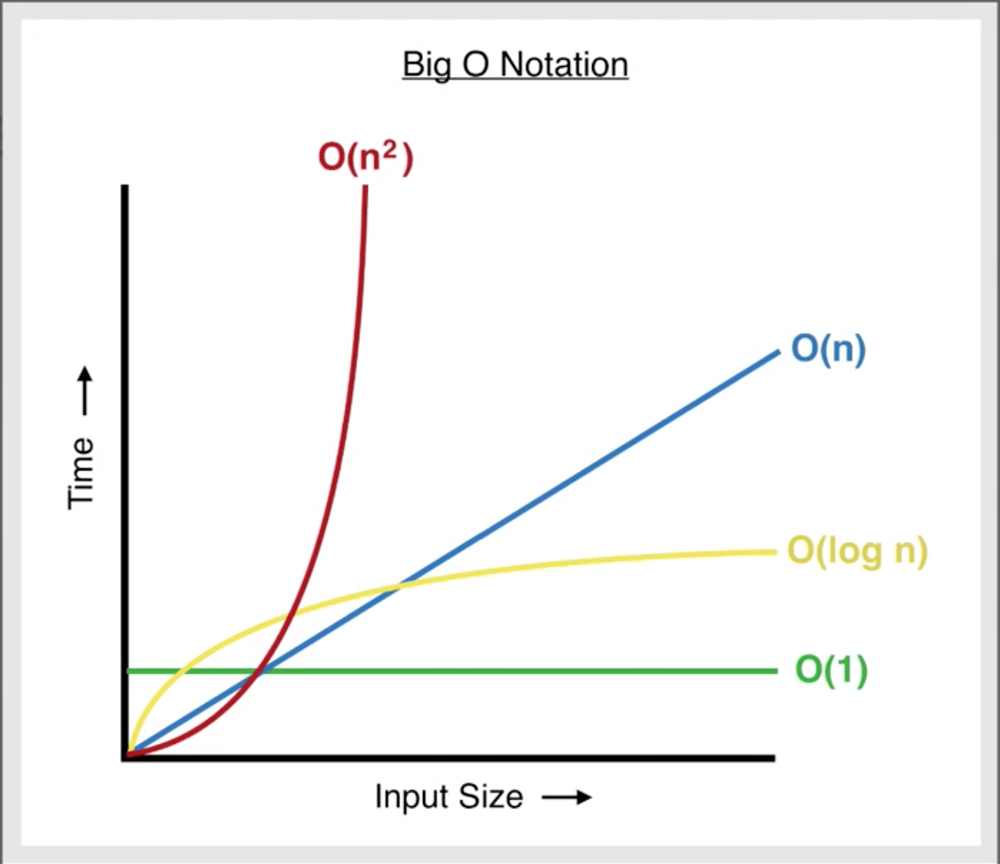

What are data structures and algorithms?
We are going to use a actual course for this because why not, we are commited to doing software engineering and data engineering so might as well do a course for this

I want to preface this section can either be super complicated but understand that we use data structures and algoritms all the time, databases have b trees an other things, simply put data structures and algoritms are the big brain ideas behind why a print fuctions works or why we can hold data in a list in python, the logic behind this had to be coded in a way the computer can understand which can be a whole lot, being aware of data structures and algorithms is important and knowing when to use them is just as important like tools in a toolbox. This is how you gain "aura" in the world of computers. This is the idea of how we use data structures and algorithms to be EFFICIENT!

First what is the definition of a data structure? Data structure is a data storage forma that enables efficient access and modification

What is an algorithm?

An unambigous, finite, sequence of intrcutions to solve a problem

reference: DSA

What is Big O notation?

Big O is a way to categorize your algorithms time or memory requirements based on input. This is meant to generalize the growth of an algorithm, I see it as an equation to figure what is the best way to figure what is the best algorithm to use based on your needs.

Hint: Look for loops this can tell us what time complexity we're using

constants are always dropped say you have two algoritims that loop through so see each value

The cost of processing one element is constant, and we repeat that constant operation n times, which results in O(n).

Constants are in theory not in important as they don't change the time complexity.

The big question we're asking is, how does the algo grow? So we're not as understanding of.

In interview questions they do a problem where the list stops at the end of the list to effect O(n) but remember we care about the algo not the constants

When we talk about space and time complexity Growth is with respect to the input constants are dropped worst case is usually the way we measure



O(1) O(n2) O(n3)

O(logn) Binary search tress

O(n) O(nlogn) Quicksort

O(n^2)

O(2^n)

o(n!)

O(sqrt(n))

## Array Data Structure
What is an array?

It is a unbreaking memory space with a certain amount bytes.

What you said:

"a[0] is just asking to view those bytes in memory through the array"

That is basically correct, but more precisely:

a[0] means "go to the memory location that represents the first element of the array and interpret those bytes as an integer."

So the array acts like a structured way to access raw memory.


How to index an array.

It takes the width then multiples by the offset then goes and get it at the memory address


address = base + (offset × width)

Example:

base = 1000
offset = 2
width = 4

1000 + (2 × 4) = 1008

Arrays don't insert, they overwrite go the a value

When it comes to deletion, it is a little more simple as its will make the value 0 so a null value.

Arrays are constant time, no matter the change nothing changes. THis made sense!! Felt a little smart.


You cannot grow an array as it is continiguous memory chunks it will fall over to the next memory chunk which could remove data.

So each element occupies 4 bytes worth of addresses (1000, 1001, 1002, 1003 all belong to arr[0]), but you only need to remember that each "step" is 4 addresses wide.
Everything else you said is spot on — index × width + base address, and you land exactly on the right chunk of memory.


Our first search, 

so how do we search on an array

# Linear search:

a[v1,v2,v3,v9]

search(a,v8)

We look for the worst case 
We are asking to look through the array and find v8, this goes through each value in a the array making it O(n)
Since it is constant


# Binary Search

When we look at our data, we ask, is it ordered?


### Simple Explanation of Binary Search

**Binary search** is a way to find something in a **sorted list** by repeatedly checking the **middle element** and eliminating half of the remaining items.

Instead of looking at every item one by one, binary search **cuts the search space in half each time**.

---

### Example

Sorted list:

```
[1, 3, 5, 7, 9, 11, 13, 15]
```

We want to find:

```
13
```

---

### Step 1 — Look at the Middle

```
[1, 3, 5, 7, 9, 11, 13, 15]
             ↑
```

Middle value = **9**

Since **13 > 9**, the number cannot be on the left side.

So we **throw away half the list**.

---

### Step 2 — Search the Remaining Half

```
[11, 13, 15]
      ↑
```

Middle value = **13**

We found it.

---

### Why It’s Fast

Each step removes **half of the remaining elements**.

Example with 1,000,000 items:

| Step | Items Remaining |
| ---- | --------------- |
| 1    | 1,000,000       |
| 2    | 500,000         |
| 3    | 250,000         |
| 4    | 125,000         |
| ...  | ...             |
| ~20  | 1               |

So even with **1 million items**, it only takes about **20 checks**.


---

### One Sentence Summary

**Binary search works by repeatedly checking the middle of a sorted list and eliminating half of the remaining elements until the target is found.**


If the input halves at each step it is either O(LogN) or O(NlogN)


Sorting time

Bubble sort

Okay what is bubble sort;

Bubble sort is an algorithm to sort an unsorted array.

The idea of it is you take the value in the 0 position ask the number in the position to the right of it if it is bigger, if it is not then we check the next index 1 next to index 2 say index 1 is bigger then index 2 then those switch places the intent is to get the largest number to the last position after the first iteration, we then continue this but stop before that last big number.


Drop insignificant vales in big o land


Lets talk about LinkedList
SO how does it work
Singly linked

a -> b -> c -> d

a double linked list 

a <-> b <-> c <-> d

deletion is constant time
can be fast

insertion fast 
insertion is O(1)


no indexs in linked list

linked list complexity

time / space complexity
prepend / append fast because you can go to the head / tail but cost more if in the middle as you have to traverse there

insertion in the middle same idea, will be more costly as you have to traverse there

deletion from ends simple as we have access to the head/ tail
deletion in the middle same idea as insertion


linked list is a data structure and do stuff to it is an algorithm

Queue is a fifo structure
First in first out
Don't need to use a double linked list because we don't need to reference the previous

What is a Stack

it is a single linked list similar to a queue

where you can only add and remove from the head

this is constant time

adding this constraints is great for speed 

Array vs linkedlist

Array you have to show the memory up front for allocation

linked list is more optimized 

linked list you have to traverse every time 

list for push and pop

array for random access


an arraylist is fundamentally an array but you do list like operations on it like push and pop


we will be using the length for these operations

for an array you want to use the least amount of memory for the the amount of capacity.

push and pop understand the length and capacity 

this is in O(n) as you have to shift everything


interview tip

your answer should always be it depends


Array buffer

you use the modulo operator when 

this is like a queue but say you're tail gets to the so then you have 

# Recursion

It is something that keeps calling itself

recursion is a function that calls itself until the problem is solved

This usually involves what is referred to as  a "base case" A base case is the point th problem is solved at.

it goes down the stack then goes up the stack


sum_to_n(4)
= 4 + sum_to_n(3)      ← not finished, waiting...

    sum_to_n(3)
    = 3 + sum_to_n(2)  ← waiting...

        sum_to_n(2)
        = 2 + sum_to_n(1)  ← waiting...

            sum_to_n(1)
            = 1   ← ✅ base case reached


Finding our base case for the sake of aura

MazeSolver

If there is a branching factor you use recursive 

Always find your base cases first.


Algorithm strategy 

Divide and conquey 

split your input into chunks then go over those into smaller chucks to work through easily

Quicksort

Divides and conquers


quicksort can be nlogn orrrr n2 dependings on how you choose your pivot and how your array is sorted


A doubly linked list is a linear data structure where each element (node) contains data and two pointers (links): one to the next node and one to the previous node

All programming will lead us to trees


A tree is like a node with "children" nodes associated with it

root - the most parent node.
The top most node 

height - the longest path from the root to the most child node 


binary tree - a tree in which has at most 2 children, at least 0 children


general tree - a tree with 0 or more children
binary search tree - a tree in which has a specific ordering to the nodes and at most 2 children
 
leaves - a node without children
balanced - a tree is perfectly balanced when any node's left and right children have the same height.
branching factor - the amount of children a tree has.

tree traversals

so you start at the root then you do the recursion based off going from the left to the right

There are three different recursion types

pre

in order

post you 


Since last time we did a breadth first search


this is the idea of going layer by layer to search for our number


we can do this with our standard search which starts from the start to the end

we can also do this with starting from the bottom and working our way up which can help maintain the tree structure


BST 

This is binary search tree

It is a recursive quicksort

Honestly pretty simple

Not going to lie.


Heap time

min heap smallest number is the base node and max heap big number is the base node

this is a way of finding the min and max values in a a tree great for priority queses


Trie tree

Visualize like an autocomplete


Graphs

honestly much simpler then I thought

its more of the traversing through them that makes them a little bit more of a challenge aside from that, not too bad. 

What is Dijskra Shortest Path

This is a greedy algorithm to find out the shortest distance to get to each node to each node.

