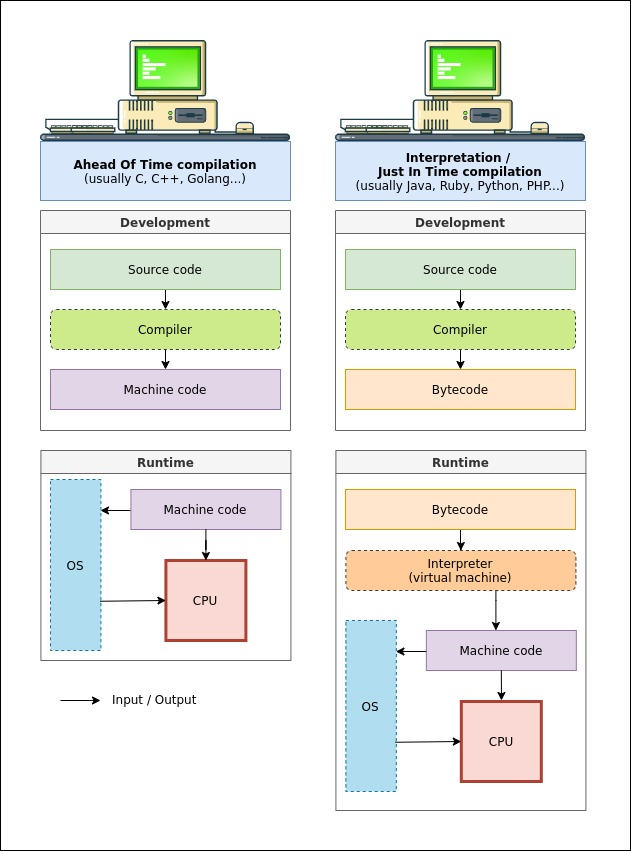

# What is Python? Executive Summary
Python is an interpreted, object-oriented, high-level programming language with dynamic semantics. Its high-level built in data structures, combined with dynamic typing and dynamic binding, make it very attractive for Rapid Application Development, as well as for use as a scripting or glue language to connect existing components together. Python's simple, easy to learn syntax emphasizes readability and therefore reduces the cost of program maintenance. Python supports modules and packages, which encourages program modularity and code reuse. The Python interpreter and the extensive standard library are available in source or binary form without charge for all major platforms, and can be freely distributed.

Often, programmers fall in love with Python because of the increased productivity it provides. Since there is no compilation step, the edit-test-debug cycle is incredibly fast. Debugging Python programs is easy: a bug or bad input will never cause a segmentation fault. Instead, when the interpreter discovers an error, it raises an exception. When the program doesn't catch the exception, the interpreter prints a stack trace. A source level debugger allows inspection of local and global variables, evaluation of arbitrary expressions, setting breakpoints, stepping through the code a line at a time, and so on. The debugger is written in Python itself, testifying to Python's introspective power. On the other hand, often the quickest way to debug a program is to add a few print statements to the source: the fast edit-test-debug cycle makes this simple approach very effective.

I thought a good way of beginning this notes section was explaining this rather high level explanation of what python in a more simple manner, as I'm a great proponent of using the Feynman technique created by Richard Feynman. 

Select a concept and map your knowledge: In this case we're doing python for this. 
Teach it to a 12-year-old: I do not have any 12 year olds to teach too so whoever may read this github repo may you feel taught. 
Review and Refine: For this section I will try to go over my gaps.
Test and Archive: This will be represented in the data engineer projects section.

Now lets take this super tech sounding summary and simplify it. 

"Python is an interpreted, object-oriented, high-level programming language with dynamic semantics."

Python simply the name of the language, like how the language of English is named English.

**Interpreted**: Now this is where it starts to get a tad bit more confusing. 

An interpreter reads computer code so what we typed within our code for python, so if you say something like print("Hello World") *which prints out "Hello World" in our terminal*, it sees this line then the interpreter makes that python language into bytecode so a language that the computer can understand as the computer can't understand python without the interpreter so then the computer will run your code causing the printing the amazing and all powerful *Hello World*. 

**Object-Oriented**: Object-oriented programming (OOP) is a computer programming model that organizes software design around data, or objects, rather than functions and logic.
So what does this mean, this is a model of thinking where you create person for example, this person has shoes, pants, shirt, and glasses for example. Each of this items of clothing would fall under your Person class, so you can make a bunch of people and specify what cloths each of the people are wearing. This leads to the core fundamentals of OOP.

    Encapsulation. The encapsulation principle states that all important information is contained inside an object and only select information is exposed. The implementation and state of each object are privately held inside a defined class. Other objects do not have access to this class or the authority to make changes. They are only able to call a list of public functions or methods. This characteristic of data hiding provides greater program security and avoids unintended data corruption.

    Say you have another class called Dog, this dog class can't see the data of the person class as the characteristics of the person fall under the person class, there are ways of combining different functions of another class but that is a little bit more advanced for the necessary explanation.

    Abstraction. Objects only reveal internal mechanisms that are relevant for the use of other objects, hiding any unnecessary implementation code. The derived class can have its functionality extended. This concept can help developers more easily make additional changes or additions over time.

    Creating class can greatly increase the readability of your code, say every time you wanted to create a new Person with your person class you had to specify exactly what the items you needed 

    Inheritance. Classes can reuse code and properties from other classes. Relationships and subclasses between objects can be assigned, enabling developers to reuse common logic, while still maintaining a unique hierarchy. Inheritance forces more thorough data analysis, reduces development time and ensures a higher level of accuracy.

    Polymorphism. Objects are designed to share behaviors, and they can take on more than one form. The program determines which meaning or usage is necessary for each execution of that object from a parent class, reducing the need to duplicate code. A child class is then created, which extends the functionality of the parent class. Polymorphism enables different types of objects to pass through the same interface.

    Syntax. This is the set of rules that define how words and punctuation are organized in a programming language.

    Coupling. This is the degree to which software elements are connected to one another. For example, if a class has its attributes change, then any other coupled class also changes.

    Association. This is the connection between one or more classes. Associations can be one to one, many to many, one to many or many to one.

Reference: [OOP](https://www.techtarget.com/searchapparchitecture/definition/object-oriented-programming-OOP)

 

I have additional python experience such as teaching multiple iterations of a python course as well as working through python with 100 days of code via Udemy. 